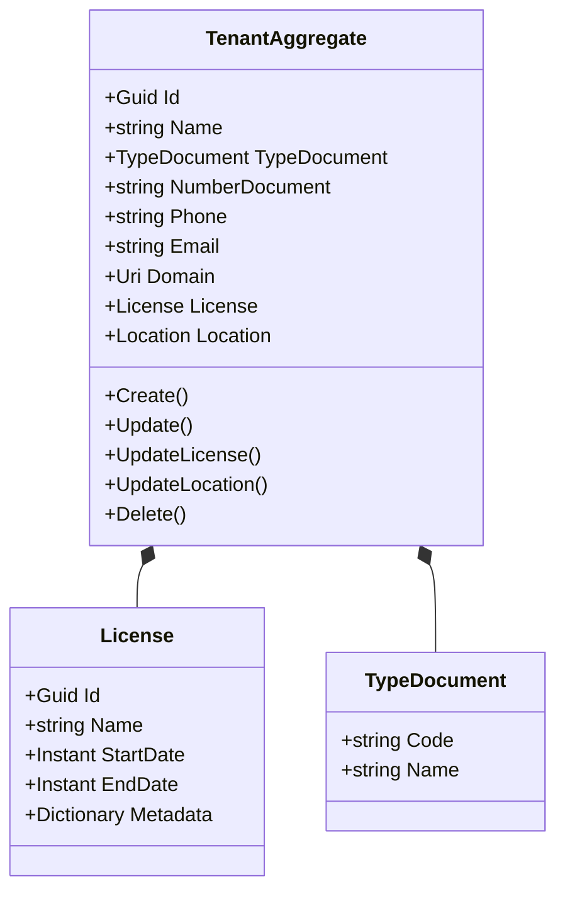
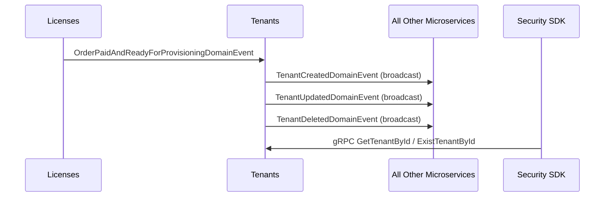

# Tenants Microservice

## Overview

The Tenants microservice is the authority on multi-tenant identity within the platform. It stores each tenant's organizational profile (name, legal document, contact information, domain), their assigned license, and their geographic location. It provides a gRPC server for fast tenant lookups and emits lifecycle events (Created, Updated, Deleted) that every other microservice in the platform subscribes to in order to maintain local organization projections. Tenant creation is triggered automatically when a license purchase succeeds, via the `OrderPaidAndReadyForProvisioningDomainEvent` from the Licenses microservice.

## Business Context

In a multi-tenant SaaS platform, every request must be scoped to a specific tenant. All microservices need to know whether a tenant exists, what license it holds, and basic organizational metadata for display purposes. Without a centralized tenant registry, each microservice would need to independently validate tenant existence, leading to inconsistencies and race conditions during onboarding.

The Tenants microservice solves this by being the single source of truth for tenant identity. When a new customer purchases a license, this microservice creates the tenant record and broadcasts the creation event. All other microservices listen to this event and create their own local projections (typically an `OrganizationAggregate`), ensuring they can validate tenant membership without synchronous cross-service calls.

For a new developer: this is the "registry of organizations" in the platform. Every company or property administration that uses the platform has exactly one tenant record here.

## Ubiquitous Language

| Term           | Definition                                                                                                                                    |
| -------------- | --------------------------------------------------------------------------------------------------------------------------------------------- |
| Tenant         | An organization (company, property administration) that subscribes to the platform. The fundamental isolation boundary for all data.          |
| Name           | The legal or commercial name of the organization.                                                                                             |
| TypeDocument   | The type of legal identification document (CC, NIT, RFC, Passport, etc.) used by the organization.                                            |
| NumberDocument | The actual identification number of the organization under the specified document type.                                                       |
| Phone          | The organization's contact phone number, validated against E.164 format.                                                                      |
| Email          | The organization's primary contact email address.                                                                                              |
| Domain         | The custom domain or subdomain assigned to the tenant for white-label access (optional).                                                      |
| License        | A value object containing the license snapshot: ID, name, start date, end date, and metadata. Determines feature access.                      |
| Location       | A value object referencing the tenant's geographic configuration (country, state, city, timezone, currency).                                   |
| Provisioning   | The process of creating a tenant workspace, triggered by a successful license purchase order.                                                  |
| gRPC Server    | The `TenantService` gRPC endpoint that allows other microservices to query tenant details without REST overhead.                               |
| Lifecycle Event| Domain events (Created, Updated, Deleted) broadcast to all platform microservices for local projection synchronization.                        |
| Organization Projection | A local read-only copy of tenant data maintained by each downstream microservice, synchronized via lifecycle events.                 |
| UpdateLicense  | The operation that replaces the tenant's current license snapshot, typically triggered when a subscription is renewed or upgraded.              |
| UpdateLocation | The operation that updates the tenant's geographic configuration.                                                                              |
| Soft Delete    | Logical removal of a tenant by marking it as inactive and deleted.                                                                             |

## Domain Model

The Tenants domain is centered on a single aggregate. The `TenantAggregate` holds the organization's identity, its license assignment, and its location configuration. License and Location are value objects that can be independently updated. The aggregate emits specific events for each type of change to allow downstream microservices to react granularly.

## Data Dictionary

### TenantAggregate

The central aggregate representing an organization on the platform.

| Field          | Type         | Description                                                      |
| -------------- | ------------ | ---------------------------------------------------------------- |
| Id             | Guid         | Unique identifier of the tenant                                  |
| Name           | string       | Legal or commercial name of the organization                     |
| TypeDocument   | TypeDocument | Type of identification document (code + name)                    |
| NumberDocument | string       | Identification number under the specified document type          |
| Phone          | string       | Contact phone number (E.164 validated)                           |
| Email          | string       | Primary contact email address                                    |
| Domain         | Uri?         | Custom domain/subdomain for white-label access (optional)        |
| License        | License      | Current license assignment with validity dates                   |
| Location       | Location     | Geographic configuration (country, city, timezone, currency)     |
| IsActive       | bool         | Whether the tenant is currently active                           |
| CreatedBy      | Guid         | User who created the tenant                                      |
| CreatedAt      | Instant      | UTC timestamp of creation                                        |
| UpdatedBy      | Guid?        | User who last modified the tenant                                |
| UpdatedAt      | Instant?     | UTC timestamp of last modification                               |

### License (Value Object)

Embedded within TenantAggregate. Represents the current license assignment.

| Field     | Type                       | Description                                              |
| --------- | -------------------------- | -------------------------------------------------------- |
| Id        | Guid                       | Reference to the license tier in the Licenses catalog    |
| Name      | string                     | Name of the license (validated with regex, max 128 chars)|
| StartDate | Instant                    | When the license validity period begins                  |
| EndDate   | Instant                    | When the license validity period ends                    |
| Metadata  | Dictionary\<string,string\>| Additional configuration data from the purchase          |

## Integration Architecture

Tenants is the most widely consumed microservice in the platform. It receives provisioning events from Licenses, serves gRPC queries for tenant lookups, and broadcasts lifecycle events that every other microservice subscribes to.

## Event Catalog

### Events Consumed

| Event                                         | Source   | Handler                | Action                              |
| --------------------------------------------- | -------- | ---------------------- | ----------------------------------- |
| `OrderPaidAndReadyForProvisioningDomainEvent` | Licenses | `CreateTenantHandler`  | Creates a new tenant from order data|

### Events Produced

| Event                              | Trigger                           | Consumers            | Purpose                                      |
| ---------------------------------- | --------------------------------- | -------------------- | -------------------------------------------- |
| `TenantCreatedDomainEvent`         | `TenantAggregate.Create()`        | All microservices    | Triggers local organization projection creation |
| `TenantUpdatedDomainEvent`         | `TenantAggregate.Update()`        | All microservices    | Updates local organization projections        |
| `TenantLicenseUpdatedDomainEvent`  | `TenantAggregate.UpdateLicense()` | Security SDK, RBAC   | Notifies license change for access recalculation |
| `TenantLocationUpdatedDomainEvent` | `TenantAggregate.UpdateLocation()`| Locations-dependent  | Notifies geographic config change             |
| `TenantDeletedDomainEvent`         | `TenantAggregate.Delete()`        | All microservices    | Triggers local organization projection removal |

## API Reference

Base path: `/api`

### Tenants (REST)

| Method | Path                | Description                                       | Auth    |
| ------ | ------------------- | ------------------------------------------------- | ------- |
| GET    | `/api/Tenant`       | Paginated list of tenants (supports Criteria)     | Bearer  |
| GET    | `/api/Tenant/{id}`  | Get a tenant by ID                                | Bearer  |
| POST   | `/api/Tenant`       | Create a new tenant manually                      | Bearer  |
| PUT    | `/api/Tenant/{id}`  | Update tenant profile information                 | Bearer  |
| DELETE | `/api/Tenant/{id}`  | Soft-delete a tenant                              | Bearer  |

### gRPC Services

| Service        | Method          | Description                                       |
| -------------- | --------------- | ------------------------------------------------- |
| TenantService  | GetTenantById   | Returns full tenant details by ID                 |
| TenantService  | ExistTenantById | Returns whether a tenant exists (boolean check)   |

All REST endpoints return RFC 7807 Problem Details on error. List responses use `Pagination<T>`.

## Key Design Decisions

- **Event broadcast to all microservices:** Tenant lifecycle events are published to a fanout exchange so every microservice can maintain its own local projection without coupling to the Tenants service at query time.

- **gRPC for synchronous lookups:** The gRPC server provides low-latency tenant validation for scenarios where caching is cold or real-time existence checks are needed.

- **License as value object:** The license assignment is an immutable snapshot replaced atomically via `UpdateLicense()`. This prevents partial updates and ensures consistency.

- **Phone validation with E.164 regex:** The aggregate enforces international phone number format to ensure consistency across tenants from different countries.

- **Automatic provisioning from purchase:** Tenant creation is triggered by the `OrderPaidAndReadyForProvisioningDomainEvent` rather than manual REST calls, automating the onboarding flow.

- **No tenant-scoped data:** Unlike other microservices, Tenants does not filter by tenant (it IS the tenant registry). Access is controlled by platform-level roles.

## Related Microservices

| Microservice     | Direction     | Integration Point                                                                    |
| ---------------- | ------------- | ------------------------------------------------------------------------------------ |
| Licenses         | Inbound       | Emits `OrderPaidAndReadyForProvisioningDomainEvent` triggering tenant creation       |
| All Microservices| Outbound      | Consume TenantCreated/Updated/Deleted events for local organization projections      |
| Security SDK     | Inbound (gRPC)| Queries tenant existence and details for request validation                          |
| Locations        | Reference     | Tenant location references geographic data from the Locations microservice           |
